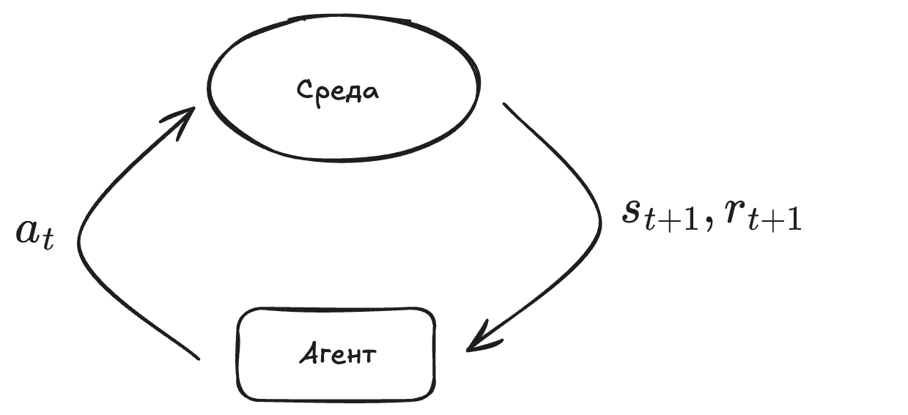
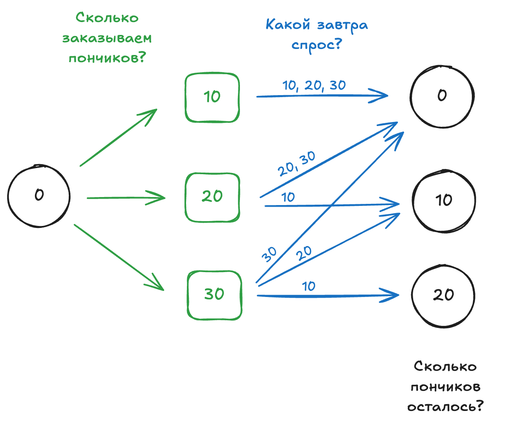
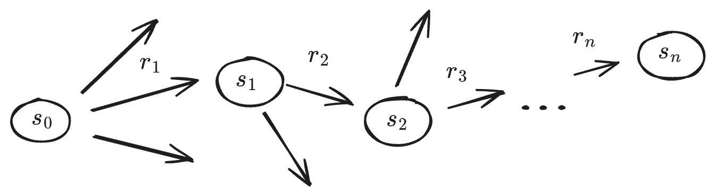
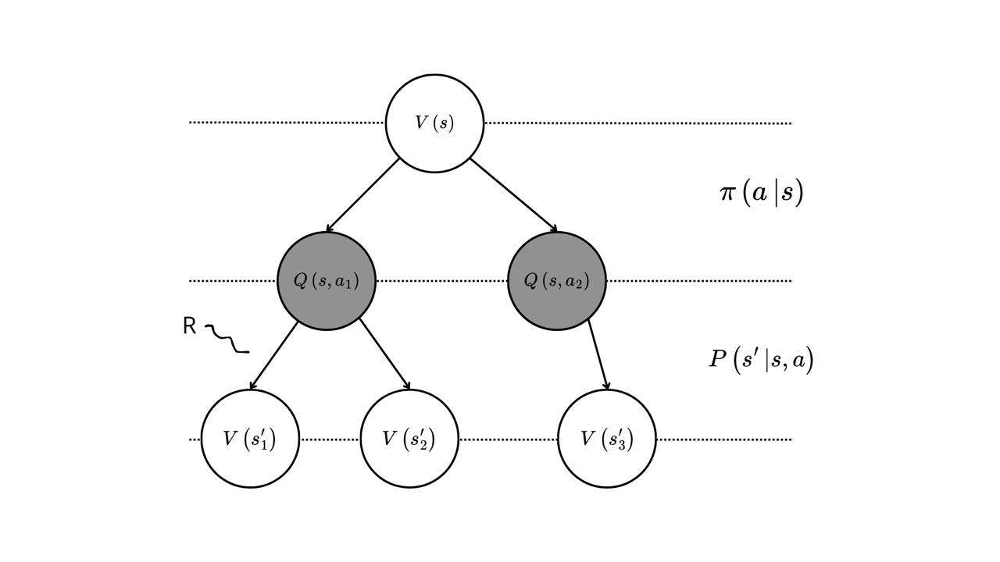

# Уравнения Беллмана: MDP, return и value function

## Введение

Представьте, что вы владелец кофейни и каждый день решаете, сколько продуктов заказать на завтра. Утром приезжает поставка: если продуктов слишком много — часть испортится, если слишком мало — кто-то из клиентов останется без латте на кокосовом. В обоих случаях вы теряете деньги. Значит, у вас есть **задача последовательного принятия решений**: каждый день выбирать объёмы заказа так, чтобы клиенты были довольны, а списания — минимальны.

Reinforcement Learning (RL) рассматривает такие ситуации как задачу обучения по **сигналу награды** (reward). В отличие от supervised learning, здесь обычно нет «правильных меток действий»: у нас нет оракула, который для каждого дня скажет оптимальный заказ, потому что «правильное» действие зависит от будущего случайного спроса и долгосрочных эффектов (например, от того, как решения сегодня повлияют на лояльность клиентов завтра). Но вы можете узнать, сколько денег вы потеряли (ваша награда — в данном случае отрицательная) из-за недозаказа или перезаказа и использовать это как сигнал для обучения модели.


## Markov Decision Process (MDP)

Чтобы решать задачу принятия решений системно, её удобно описать в формальном математическом фреймворке. В RL это делается при помощи **Markov Decision Process (MDP)**. MDP — это математическая модель, которая помогает описывать ситуации, где результат действий частично случаен и зависит от агента, принимающего решения.

MDP — это модель для ситуаций, где:

- агент (мы) выбирает действия;
- среда реагирует на эти действия и может вести себя **случайно**;
- агент получает сигнал качества решения — **награду** (reward);
- процесс повторяется шаг за шагом.

Формально MDP задаётся набором:

```math
(\mathcal{S}, \mathcal{A}, P, R, \gamma),
```
где:
- $\mathcal{S}$ — множество состояний $s$ (например, сколько пончиков осталось);
- $\mathcal{A}$ — множество действий $a$ (например, сколько пончиков заказать);
- $P(s' \mid s, a)$ — вероятности перехода в следующее состояние $s'$ (случайность среды, например, какой спрос на пончики оказался);
- $R(s, a, s')$ — награда за переход (например, прибыль минус списания и потери от недопродаж);
- $\gamma \in [0,1)$ — коэффициент дисконтирования (зачем он нужен — разберём дальше).

Поскольку решения принимаются последовательно, агенту нужен «план поведения» на будущее. Такой план называется **политикой** (policy) и обычно обозначается $\pi$. Политика может быть:
- **детерминированной**: $\pi(s) = a$;
- **стохастической**: $\pi(a \mid s)$ — агент возвращает распределение вероятностей по действиям. Стохастическая политика удобна для исследования (exploration) среды в некоторых алгоритмах.

Схематично процесс взаимодействия агента со средой выглядит так:

```math
s_t \;\rightarrow\; a_t \;\rightarrow\; (r_{t+1},\, s_{t+1}).
```
В момент $t$ мы находимся в состоянии $s_t$ и выбираем действие $a_t$; затем среда переводит нас в состояние $s_{t+1}$ и выдаёт награду $r_{t+1}$.

<p align="center">
  
</p>

<p align="center">
  <em>Рисунок 1. Петля взаимодействия агент–среда в MDP.</em>
</p>


### Пример: пончики в кофейне

Представим, что наша кофейня продаёт шоколадные пончики, а люди любят их свежими. Каждый день вы делаете заказ на завтра. Для простоты дискретизируем выбор:

- действия: $a_t \in \{10, 20, 30\}$ — сколько пончиков заказать сегодня;
- спрос тоже дискретный (для упрощения): завтра люди съедят $10$, $20$ или $30$ пончиков; спрос **случайный**: мы можем со временем оценить его распределение, но заранее не знаем точный спрос.
  
Схематично этот процесс изображён на рисунке 2.

Пусть состояние $s_t$ — это количество пончиков, оставшихся в конце дня (или, эквивалентно, на начало следующего дня). Тогда один шаг взаимодействия можно описать так:

- агент выбирает действие $a_t$;
- среда «выдаёт» спрос и, как результат, формирует награду $r_{t+1}$ (например, прибыль минус списания и потерянные продажи) и переводит систему в новое состояние $s_{t+1}$. Награда не изображена на рисунке, она обычно является функцией наших действий и состояний $R(s_t, a_t, s_{t+1})$.

<p align="center">
  
</p>

<p align="center">
  <em>Рисунок 2. Пример с пончиками: действие, спрос и переход между состояниями.</em>
</p>

### Марковское свойство (Markov property)

MDP предполагает, что среда удовлетворяет **свойству Маркова**:

> Текущее состояние содержит всю информацию, необходимую для предсказания будущего (при заданном действии).

Формально это означает:

```math
P(s_{t+1}\mid s_t, a_t, s_{t-1}, a_{t-1}, \dots) = P(s_{t+1}\mid s_t, a_t).
```
Интуитивно: прошлое важно только через то, **что уже закодировано в текущем состоянии**.

В примере с пончиками спрос, вероятно, зависит от скрытых факторов, таких как день недели, погода, мероприятия в городе и т. д. Тогда, чтобы сохранить марковость, состояние должно включать и эти факторы; иначе часть важной информации «теряется», и текущее состояние не будет полностью определять распределение будущих состояний.


## Value function

Представим, что траектория принятия решений — это неделя работы кофейни: каждый день мы выбираем, сколько пончиков заказать, а затем наблюдаем итог — сколько пончиков пришлось списать и сколько раз пончиков не хватило (что означает потерянные продажи и недовольных клиентов). Важно, что **эффект решений может быть отложенным**: например, частое отсутствие пончиков может снизить лояльность клиентов и ухудшить спрос в будущем.

Зная, как прошёл очередной день, мы можем определить **награду** (reward) — скалярный сигнал, который говорит, насколько «хорошим» оказался этот шаг. Будем обозначать награду на шаге как $r_{t+1}$, если она получается после перехода из состояния $s_t$ в $s_{t+1}$. В нашем случае награда — это функция перехода:

```math
r_{t+1} = R(s_t, a_t, s_{t+1}).
```
### Суммарная награда

Нас интересует не только награда за один день, а суммарный эффект решений. Поэтому вводят **return** — дисконтированную сумму будущих наград, начиная с момента $t$:

```math
G_t = r_{t+1} + \gamma r_{t+2} + \gamma^2 r_{t+3} + \dots
```
где $\gamma \in [0, 1)$ — коэффициент дисконтирования (чем он меньше, тем сильнее мы «предпочитаем» ближайшие награды).

То есть $G_t$ — это случайная сумма наград по одной траектории решений (см. рисунок 3 ниже).

<p align="center">
  
</p>

<p align="center">
  <em>Рисунок 3. Пример траектории.</em>
</p>


Дисконтирование полезно по двум причинам:

1. **Смысловая**: ближайшая награда часто важнее из-за неопределённости будущего и стоимости времени (деньги сегодня обычно ценнее денег завтра: инфляция, потерянная возможность, изменение цен).
2. **Математическая**: при бесконечном горизонте $\gamma < 1$ обеспечивает сходимость суммы.

Суммарная награда $G_t$ зависит:
- от наших действий (сколько пончиков мы заказываем), $a_t \sim \pi(\cdot \mid s_t)$;
- от реакции среды (случайный спрос, внешние факторы и т. д.), $s_{t+1} \sim P(\cdot \mid s_t, a_t)$.

Поэтому $G_t$ — случайная величина: одна конкретная неделя даст один конкретный результат (один *sample*), но нас интересует **средний** результат — математическое ожидание $\mathbb{E}_\pi\left[G_t\right]$.

Ожидание берётся по всем источникам случайности в будущем: по действиям $a \sim \pi(\cdot \mid s)$ и по переходам среды $s' \sim P(\cdot \mid s, a)$ (а также, при необходимости, по случайному стартовому состоянию $s_0$). Идея RL — выбирать политику, которая максимизирует ожидаемую суммарную награду. Интуитивно, если из одного и того же состояния политика $\pi_1$ в среднем приводит к большему return, чем $\pi_2$, то $\pi_1$ «лучше».

Проблема в том, что напрямую сравнивать политики по $\mathbb{E}[G_0]$ неудобно: чтобы надёжно оценить это ожидание, нужно «проиграть» много полных траекторий (например, много недель) и усреднить результат. Поэтому нам нужны **промежуточные метрики**, которые позволяют оценивать качество решений локально — не дожидаясь окончания эпизода. Именно такую роль играют функции ценности $V^\pi$ и $Q^\pi$: они оценивают ожидаемый return из состояния (или пары состояние–действие) и тем самым помогают сравнивать и улучшать политики.

### Функции ценности $V^\pi$ и $Q^\pi$

Пусть $\pi$ — политика (правило выбора действий). Тогда естественная цель — максимизировать ожидаемый return из начального состояния:

```math
J(\pi) = \mathbb{E}_\pi\left[G_0\right].
```
**State-value function** определяет ожидаемый return, если мы находимся в состоянии $s$ и дальше действуем по политике $\pi$:

```math
V^\pi(s) = \mathbb{E}_\pi\left[ G_t \mid s_t = s \right].
```
**Action-value function** определяет ожидаемый return, если в состоянии $s$ мы сначала выбрали действие $a$, а затем продолжаем следовать политике $\pi$:

```math
Q^\pi(s, a) = \mathbb{E}_\pi\left[ G_t \mid s_t = s,\; a_t = a \right].
```
Интуитивно, $V^\pi$ говорит: «насколько хорошо оказаться в состоянии $s$ и дальше действовать по $\pi$», а $Q^\pi$ — «насколько хорошо сделать конкретное действие $a$ в состоянии $s$ и затем следовать $\pi$». Эти функции служат удобными метриками для сравнения и улучшения политик.

Чтобы закрепить идею, посмотрим на схему переходов из текущего состояния. Из одного состояния возможны разные действия (серые круги). Выбирая действие, агент может делать это **случайно** — согласно $\pi(a\mid s)$. После этого среда тоже может вести себя **случайно** и перевести нас в одно из следующих состояний, выдав награду. Это и есть два источника неопределённости, по которым мы берём ожидание: выбор действия $a\sim\pi(\cdot\mid s)$ и переход $s'\sim P(\cdot\mid s,a)$.

<p align="center">
  
</p>

<p align="center">
  <em>Рисунок 4. Схема переходов для функций ценности.</em>
</p>

> **Задание 1.**
>
> Посмотрите на рисунок 4: можете ли вы выразить $V^\pi(s)$ через $Q^{\pi}(s, a)$? А если наоборот?

## Уравнение Беллмана (Bellman equation)

Теперь распишем нашу суммарную награду в виде рекурсивной формулы:

```math
G_t = r_{t+1} + \gamma G_{t+1}.
```
Возьмём условное математическое ожидание с обеих сторон при фиксированном текущем состоянии $s_t = s$:

```math
V^\pi(s) = \mathbb{E}_\pi\left[G_t\mid s_t = s \right]
= \mathbb{E}_\pi\left[r_{t+1} + \gamma G_{t+1}\mid s_t = s \right]
= \mathbb{E}_\pi\left[R(s, a_t, s_{t+1}) + \gamma V^\pi(s_{t+1})\mid s_t = s \right].
```
Это и есть **уравнение Беллмана для $V^\pi$** (Bellman expectation equation): ценность состояния $V^\pi(s)$ равна ожидаемой немедленной награде плюс дисконтированная ценность следующего состояния. Интуитивно это «что я получу сейчас» + «что я ожидаю получить потом», а вклад «потом» уменьшается коэффициентом $\gamma$.

Если пространство состояний дискретно, эту формулу часто записывают в виде суммы:

```math
V^\pi(s) = \sum_{a \in \mathcal{A}} \pi(a \mid s)\;
\sum_{s' \in \mathcal{S}} P(s' \mid s, a)\;\Big( R(s, a, s') + \gamma V^\pi(s') \Big).
```
> **Задание 2.**
>
> Что такое $V^\pi(s)$, когда $\gamma = 0$? Можно ли в задаче с пончиками сделать $\gamma = 0$? Нужны ли для этого какие-то допущения?

Похожую формулу можно выписать для action-value function:

```math
Q^{\pi}(s, a) = \mathbb{E}_\pi\left[ G_t \mid s_t = s, a_t = a \right]
= \mathbb{E}_\pi\left[ r_{t+1} + \gamma \,\mathbb{E}_{a_{t+1}\sim \pi(\cdot\mid s_{t+1})}\big[Q^{\pi}(s_{t+1}, a_{t+1})\big] \mid s_t = s, a_t = a \right].
```
> **Задание 3.**
>
> Как будет выглядеть формула для $Q^{\pi}(s, a)$ в дискретном случае?

### Зачем нужны уравнения Беллмана?

Уравнения Беллмана дают ключевую идею RL: **ценность (value) текущего состояния можно выразить через ценность будущего состояния**. То есть value function должна быть **самосогласованной**: корректная функция ценности должна «сходиться сама на себя» через один шаг в будущее.

Уравнение Беллмана можно переписать в итерационном виде и использовать для нахождения $V^\pi$ при фиксированной политике $\pi$:

```math
V_{k+1}(s)\leftarrow \sum_{a\in\mathcal{A}}\pi(a|s)\sum_{s'\in\mathcal{S}}P(s'|s,a)\Big(R(s,a,s')+\gamma V_k(s')\Big).
```
Если повторять такие обновления, значения $V_k$ сходятся к $V^\pi$. Почему этот процесс сходится и к чему именно он сходится, мы обсудим в следующих уроках.

Зачем нам знать $V^\pi$ или $Q^\pi$? Потому что это прямой способ **оценивать** и **улучшать** политику. Например, популярный алгоритм *policy iteration* делает следующее:

- **Оценка политики (policy evaluation):** по уравнению Беллмана находим $V^\pi$ или $Q^\pi$ для текущей $\pi$.
- **Улучшение политики (policy improvement):** делаем политику более «жадной»: если известна таблица $Q^\pi(s,a)$, то естественный шаг улучшения:

```math
\pi'(s)=\arg\max_a Q^\pi(s,a).
```

Такая $\pi'$ будет не хуже $\pi$ (а часто — лучше).

В пределе это приводит к оптимальной политике $\pi^*$, что и решает задачу принятия решений.

> При знании динамики MDP (то есть если известны вероятности переходов и награды) обновления можно считать напрямую (динамическое программирование).  
> Если динамика MDP неизвестна, те же ожидания оценивают по данным взаимодействия со средой — из этого вырастают методы Monte Carlo и TD-обучения. Об этом вы узнаете в следующих уроках.

### Практический пример

Ниже — пример кода, который использует итеративную форму уравнения Беллмана для фиксированной политики $\pi$ в нашей игрушечной задаче с пончиками. Мы оцениваем $V^\pi$ итерациями и находим значения функции ценности для всех возможных состояний.

В этой постановке состояние $s$ — это **сколько пончиков осталось вчера** (сегодня их нельзя продать, поэтому мы их выбрасываем и платим штраф). После выбора заказа $a$ и наблюдения спроса $d$ новое состояние равно $s_{t+1}=\max(0, a-d)$ — это остаток *свежих* пончиков сегодня, который станет «несвежим» завтра.


<!-- BEGIN INCLUDE: code/bellman.py -->
```python
import numpy as np

actions = np.array([10, 20, 30])  # сколько заказать
demands = np.array([10, 20, 30])  # спрос
p_d = np.array([0.3, 0.4, 0.3])  # распределение спроса

states = np.array([0, 10,
                   20])  # Возможные состояния
idx = {s: i for i, s in enumerate(states)}

# параметры экономики, просто пример для подсчета награды
price = 3.0  # выручка за 1 проданный
cost = 1.2  # себестоимость заказа за 1
waste = 0.5  # штраф за выброс 1 "несвежего" 
stockout = 2.0  # штраф за дефицит (не удовлетворили спрос)
gamma = 0.9 # гиперпараметр гамма


# простая политика: если вчера много осталось -> заказываем меньше
def policy(s):
    if s == 20:
        return 10
    return 20


def step(s, a, d):
    sold = min(a, d)
    shortage = max(0, d - a)
    s_next = max(0, a - d)  # остаток свежих сегодня -> мусор завтра
    # награду придумываем сами, может быть абсолютно любой функцией
    r = price * sold - cost * a - stockout * shortage - waste * s
    return r, s_next


# Итеративное уравнение Беллмана для нашей фиксированной политики
# для каждого возможно состояния найдем его value
V = np.zeros(len(states))
# чем дольше итерируемся, тем лучше точность
for _ in range(50):
    # для каждого состояния найдем его текущую аппроксимацию value
    V_new = np.zeros_like(V)
    for s in states:
        a = policy(s)
        total = 0.0
        for d, pd in zip(demands, p_d):
            r, s_next = step(s, a, d)
            total += pd * (r + gamma * V[idx[s_next]])
        V_new[idx[s]] = total
    V = V_new

print("V^pi(s):")
for s in states:
    print(f"s={s}: {V[idx[s]]:.3f}")
```
<!-- END INCLUDE: code/bellman.py -->

## Заключение

Мы ввели математический фреймворк MDP для постановки задач последовательного принятия решений. Затем определили целевую величину — ожидаемый return, который хотим максимизировать, выбирая политику. Чтобы улучшать политику, не дожидаясь окончания длинных траекторий, нам нужны промежуточные оценки качества — поэтому мы ввели функции ценности $V^\pi$ и $Q^\pi$. На их основе мы вывели уравнения Беллмана — условия самосогласованности функций ценности: «ценность сейчас» равна ожидаемой награде на следующем шаге плюс дисконтированная «ценность потом». Эти уравнения лежат в основе итеративных методов оценки и улучшения политик и приводят к решению задачи принятия решений.
